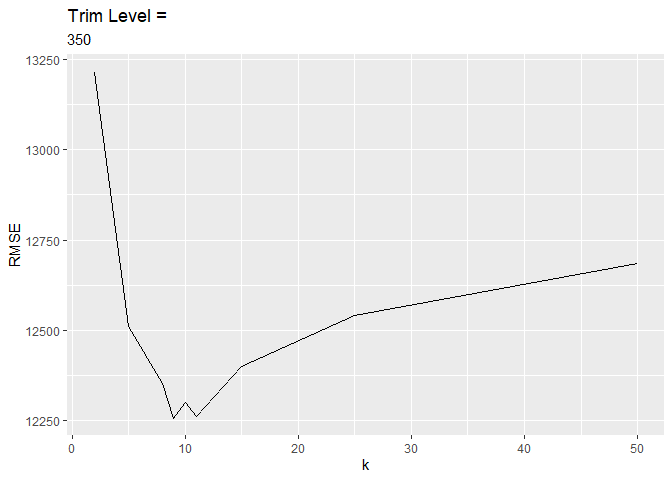

## 1) Data visualization: flights at ABIA

To analyze the delay for all Austin departure flights, I categorize the
departure time into 24 hours. The delay is shorter in the morning
(5:00-9:00) and relatively steady afterwards. The delay gets longer at
night (after 21:00).  
The delay is quite even for every day in a week and every month in a
year.

This plot shows the destination airports for all Austin departure
flights, where large sizes indicate more flights.

## 2) Wrangling the Olympics

### A)

95th percentile of heights for female competitors across all Athletics
events:

    ##   quantile(height, 0.95)
    ## 1                    183

### B)

The women’s event that had the greatest variability in competitor’s
heights, as measured by the standard deviation:

    ## # A tibble: 1 × 2
    ##   event                      sd_height
    ##   <chr>                          <dbl>
    ## 1 Rowing Women's Coxed Fours      10.9

### C)

Average age of male and female swimmers over time:

    ## # A tibble: 6 × 3
    ## # Groups:   year [6]
    ##    year sex   avg_age
    ##   <int> <chr>   <dbl>
    ## 1  1900 M        18  
    ## 2  1904 M        20.1
    ## 3  1906 M        22  
    ## 4  1908 M        23.5
    ## 5  1912 M        27  
    ## 6  1920 M        26

The average age of male swimmers went up significantly 1900-1924, then
went down significantly to the level in 1900. After that, it increased
steadily.  
The trend looks similar for male swimmers relatively to female swimmers.

## 3) K-nearest neighbors: cars

K-nearest-neighbors  
x-axis is different different values of K  
y-axis is out-of-sample root mean squared error (RMSE)  
There are two plots for two trim levels: 350 and 65 AMG

For trim level 350, the optimal K = 9. A plot of the fitted model
(i.e. predictions vs. x):

For trim level 65 AMG, the optimal K = 10. A plot of the fitted model
(i.e. predictions vs. x):

65 AMG yields a larger optimal value of K. From the plots of fitted
models, 65 AMG is more clustered, so the number of nearest neighbors can
be larger.
