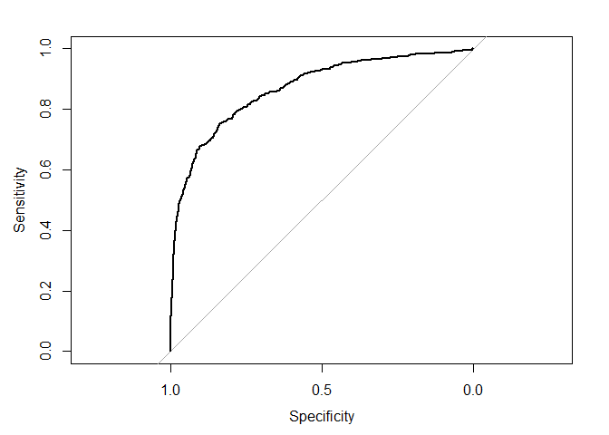
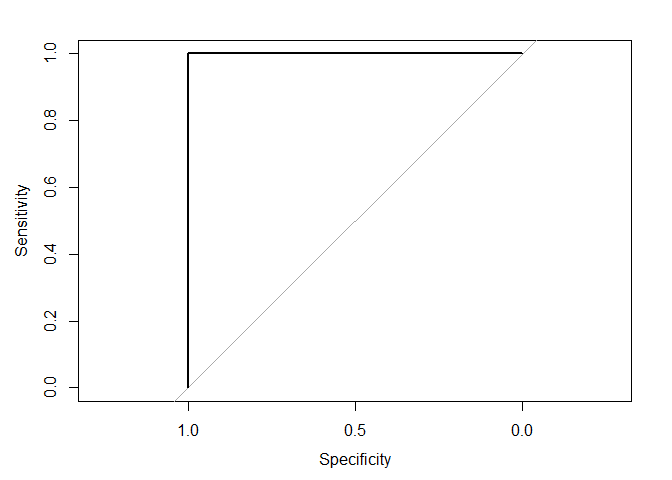

## Saratoga house prices

I use two models and several features to predict the house price in
Saratoga: linear regression and KNN regression. I use 10-fold cross
validation and out-of-sample RMSE to measure the model performance. I
standardize variables to improve model performance.

Linear regression results:

    ## Linear Regression 
    ## 
    ## 1728 samples
    ##   15 predictor
    ## 
    ## No pre-processing
    ## Resampling: Cross-Validated (10 fold) 
    ## Summary of sample sizes: 1555, 1555, 1555, 1556, 1555, 1555, ... 
    ## Resampling results:
    ## 
    ##   RMSE       Rsquared   MAE      
    ##   0.5951011  0.6424518  0.4223487
    ## 
    ## Tuning parameter 'intercept' was held constant at a value of TRUE

KNN regression results:

    ## k-Nearest Neighbors 
    ## 
    ## 1728 samples
    ##   15 predictor
    ## 
    ## No pre-processing
    ## Resampling: Cross-Validated (10 fold) 
    ## Summary of sample sizes: 1555, 1555, 1555, 1556, 1555, 1555, ... 
    ## Resampling results across tuning parameters:
    ## 
    ##   k  RMSE       Rsquared   MAE      
    ##   5  0.6185145  0.6193737  0.4259107
    ##   7  0.6166096  0.6212428  0.4242421
    ##   9  0.6156431  0.6229348  0.4216721
    ## 
    ## RMSE was used to select the optimal model using the smallest value.
    ## The final value used for the model was k = 9.

The linear regression model has a better prediction performance, with a
lower RMSE.

## Classification and retrospective sampling

Bar plot of default probability by credit history:  

Logistic regression results:

    ## 
    ## Call:
    ## glm(formula = Default ~ duration + amount + installment + age + 
    ##     history + purpose + foreign, family = "binomial", data = loan)
    ## 
    ## Coefficients:
    ##                       Estimate Std. Error z value Pr(>|z|)    
    ## (Intercept)         -7.075e-01  4.726e-01  -1.497  0.13435    
    ## duration             2.526e-02  8.100e-03   3.118  0.00182 ** 
    ## amount               9.596e-05  3.650e-05   2.629  0.00856 ** 
    ## installment          2.216e-01  7.626e-02   2.906  0.00366 ** 
    ## age                 -2.018e-02  7.224e-03  -2.794  0.00521 ** 
    ## historypoor         -1.108e+00  2.473e-01  -4.479 7.51e-06 ***
    ## historyterrible     -1.885e+00  2.822e-01  -6.679 2.41e-11 ***
    ## purposeedu           7.248e-01  3.707e-01   1.955  0.05058 .  
    ## purposegoods/repair  1.049e-01  2.573e-01   0.408  0.68346    
    ## purposenewcar        8.545e-01  2.773e-01   3.081  0.00206 ** 
    ## purposeusedcar      -7.959e-01  3.598e-01  -2.212  0.02694 *  
    ## foreigngerman       -1.265e+00  5.773e-01  -2.191  0.02849 *  
    ## ---
    ## Signif. codes:  0 '***' 0.001 '**' 0.01 '*' 0.05 '.' 0.1 ' ' 1
    ## 
    ## (Dispersion parameter for binomial family taken to be 1)
    ## 
    ##     Null deviance: 1221.7  on 999  degrees of freedom
    ## Residual deviance: 1070.0  on 988  degrees of freedom
    ## AIC: 1094
    ## 
    ## Number of Fisher Scoring iterations: 4

In both the bar plot (or the data set) and the logistic regression,
compared to `historygood`, `historypoor` decreases the default
probability, and `historyterrible` further decreases the default
probability.

This relationship is counter-intuitive, probably resulting from the
inappropriate sampling process. To improve the sampling scheme, the bank
can randomly select a subset of loans that had not defaulted.

## Children and hotel reservations

### Model building

Baseline model 1. I choose the threshold = 0.1 mainly considering a
balance between true positive rate (sensitivity) and false positive rate
(1 - specificity).

    ## Confusion Matrix and Statistics
    ## 
    ##           Reference
    ## Prediction    0    1
    ##          0 4491  189
    ##          1 3778  542
    ##                                           
    ##                Accuracy : 0.5592          
    ##                  95% CI : (0.5489, 0.5695)
    ##     No Information Rate : 0.9188          
    ##     P-Value [Acc > NIR] : 1               
    ##                                           
    ##                   Kappa : 0.0879          
    ##                                           
    ##  Mcnemar's Test P-Value : <2e-16          
    ##                                           
    ##             Sensitivity : 0.5431          
    ##             Specificity : 0.7415          
    ##          Pos Pred Value : 0.9596          
    ##          Neg Pred Value : 0.1255          
    ##              Prevalence : 0.9188          
    ##          Detection Rate : 0.4990          
    ##    Detection Prevalence : 0.5200          
    ##       Balanced Accuracy : 0.6423          
    ##                                           
    ##        'Positive' Class : 0               
    ## 

Baseline model 2 at threshold = 0.1:

    ## Confusion Matrix and Statistics
    ## 
    ##           Reference
    ## Prediction    0    1
    ##          0 7257  218
    ##          1 1012  513
    ##                                           
    ##                Accuracy : 0.8633          
    ##                  95% CI : (0.8561, 0.8704)
    ##     No Information Rate : 0.9188          
    ##     P-Value [Acc > NIR] : 1               
    ##                                           
    ##                   Kappa : 0.3875          
    ##                                           
    ##  Mcnemar's Test P-Value : <2e-16          
    ##                                           
    ##             Sensitivity : 0.8776          
    ##             Specificity : 0.7018          
    ##          Pos Pred Value : 0.9708          
    ##          Neg Pred Value : 0.3364          
    ##              Prevalence : 0.9188          
    ##          Detection Rate : 0.8063          
    ##    Detection Prevalence : 0.8306          
    ##       Balanced Accuracy : 0.7897          
    ##                                           
    ##        'Positive' Class : 0               
    ## 

Best linear model at threshold = 0.1:

    ## Confusion Matrix and Statistics
    ## 
    ##           Reference
    ## Prediction    0    1
    ##          0 7266  217
    ##          1 1003  514
    ##                                           
    ##                Accuracy : 0.8644          
    ##                  95% CI : (0.8572, 0.8715)
    ##     No Information Rate : 0.9188          
    ##     P-Value [Acc > NIR] : 1               
    ##                                           
    ##                   Kappa : 0.3905          
    ##                                           
    ##  Mcnemar's Test P-Value : <2e-16          
    ##                                           
    ##             Sensitivity : 0.8787          
    ##             Specificity : 0.7031          
    ##          Pos Pred Value : 0.9710          
    ##          Neg Pred Value : 0.3388          
    ##              Prevalence : 0.9188          
    ##          Detection Rate : 0.8073          
    ##    Detection Prevalence : 0.8314          
    ##       Balanced Accuracy : 0.7909          
    ##                                           
    ##        'Positive' Class : 0               
    ## 

### Model validation: step 1

ROC curve for the best model:  

### Model validation: step 2

I split the validation data set into 20 folds, where each fold has about
250 bookings. In each fold, I calculate the expected number of bookings
with children versus the actual number of bookings with children.

    ##    fold expected_children actual_children
    ## 1     1          21.70967              22
    ## 2     2          22.25847              25
    ## 3     3          22.55427              18
    ## 4     4          25.17844              25
    ## 5     5          21.20312              23
    ## 6     6          20.83748              23
    ## 7     7          23.09596              21
    ## 8     8          19.29644              24
    ## 9     9          20.27112              13
    ## 10   10          27.07746              24
    ## 11   11          18.35804              15
    ## 12   12          21.40634              17
    ## 13   13          17.71660              15
    ## 14   14          19.81054              16
    ## 15   15          19.83295              18
    ## 16   16          20.38584              19
    ## 17   17          23.43068              21
    ## 18   18          20.93573              23
    ## 19   19          17.30087              16
    ## 20   20          23.27040              24

## Mushroom classification

The y variable is a dummy, where it equals to 1 if a mushroom is
poisonous and 0 otherwise. I exclude `veil.type` from x variables as it
has no variation.

I fit a lasso model, and use a 10-fold cross validation to choose an
optimal lambda. The optimal lambda is:

    ## [1] 0.0001739773

I use this optimal lambda to predict the out-of-sample probability that
a mushroom is poisonous. ROC curve:  

# Based on this ROC curve, recommend a probability threshold for declaring a mushroom poisonous. How well does your model perform at this threshold, as measured by false positive rate and true positive rate?
