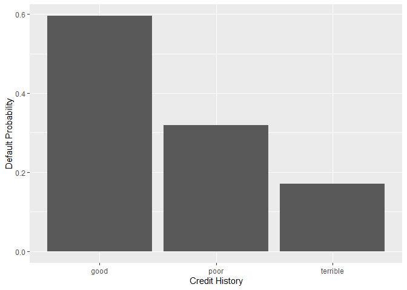
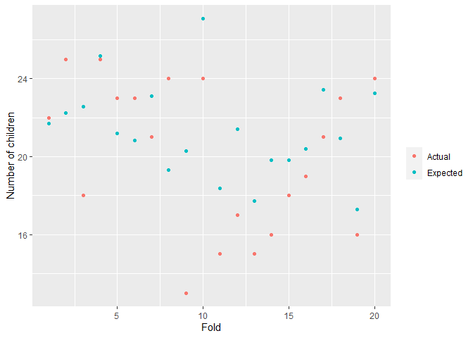

## Saratoga house prices

I use two models and several features to predict the house price in
Saratoga: linear regression and KNN regression. I use 10-fold cross
validation and out-of-sample RMSE to measure the model performance. I
standardize variables to improve model performance.

Below is the results of linear regression:

    ## Linear Regression 
    ## 
    ## 1728 samples
    ##   15 predictor
    ## 
    ## No pre-processing
    ## Resampling: Cross-Validated (10 fold) 
    ## Summary of sample sizes: 1555, 1556, 1556, 1555, 1555, 1555, ... 
    ## Resampling results:
    ## 
    ##   RMSE       Rsquared   MAE      
    ##   0.5928644  0.6448426  0.4227413
    ## 
    ## Tuning parameter 'intercept' was held constant at a value of TRUE

Below is the results of KNN regression:

    ## k-Nearest Neighbors 
    ## 
    ## 1728 samples
    ##   15 predictor
    ## 
    ## No pre-processing
    ## Resampling: Cross-Validated (10 fold) 
    ## Summary of sample sizes: 1555, 1555, 1555, 1555, 1555, 1555, ... 
    ## Resampling results across tuning parameters:
    ## 
    ##   k  RMSE       Rsquared   MAE      
    ##   5  0.6267375  0.6126267  0.4352020
    ##   7  0.6169284  0.6231567  0.4293373
    ##   9  0.6175535  0.6229579  0.4258582
    ## 
    ## RMSE was used to select the optimal model using the smallest value.
    ## The final value used for the model was k = 7.

The linear regression model has better prediction performance, with a
lower RMSE.

## Classification and retrospective sampling

Bar plot of default probability by credit history:

Logistic regression results:

    ## 
    ## Call:
    ## glm(formula = Default ~ duration + amount + installment + age + 
    ##     history + purpose + foreign, family = "binomial", data = loan)
    ## 
    ## Coefficients:
    ##                       Estimate Std. Error z value Pr(>|z|)    
    ## (Intercept)         -7.075e-01  4.726e-01  -1.497  0.13435    
    ## duration             2.526e-02  8.100e-03   3.118  0.00182 ** 
    ## amount               9.596e-05  3.650e-05   2.629  0.00856 ** 
    ## installment          2.216e-01  7.626e-02   2.906  0.00366 ** 
    ## age                 -2.018e-02  7.224e-03  -2.794  0.00521 ** 
    ## historypoor         -1.108e+00  2.473e-01  -4.479 7.51e-06 ***
    ## historyterrible     -1.885e+00  2.822e-01  -6.679 2.41e-11 ***
    ## purposeedu           7.248e-01  3.707e-01   1.955  0.05058 .  
    ## purposegoods/repair  1.049e-01  2.573e-01   0.408  0.68346    
    ## purposenewcar        8.545e-01  2.773e-01   3.081  0.00206 ** 
    ## purposeusedcar      -7.959e-01  3.598e-01  -2.212  0.02694 *  
    ## foreigngerman       -1.265e+00  5.773e-01  -2.191  0.02849 *  
    ## ---
    ## Signif. codes:  0 '***' 0.001 '**' 0.01 '*' 0.05 '.' 0.1 ' ' 1
    ## 
    ## (Dispersion parameter for binomial family taken to be 1)
    ## 
    ##     Null deviance: 1221.7  on 999  degrees of freedom
    ## Residual deviance: 1070.0  on 988  degrees of freedom
    ## AIC: 1094
    ## 
    ## Number of Fisher Scoring iterations: 4

In the `history` variable: compared to `good` category, `poor` category
decreases the default probability, and `terrible` category decreases the
default probability even more. This is reasonable as low credit level
means low payback ability, thus more likely to default.

The sampling process (*It then attempted to match each default with
similar sets of loans that had not defaulted*) is not appropriate for
predicting defaults. Features used in prediction are similar between
defaulted and not defaulted cases. Thus, the outcome variable `Default`
has high variance and low robustness.

# would you recommend any changes to the bank’s sampling scheme?

## Children and hotel reservations

### Model building

Baseline model 1. I choose the threshold = 0.1 mainly considering a
balance between true positive rate and false positive rate.

    ## Confusion Matrix and Statistics
    ## 
    ##           Reference
    ## Prediction    0    1
    ##          0 4491  189
    ##          1 3778  542
    ##                                           
    ##                Accuracy : 0.5592          
    ##                  95% CI : (0.5489, 0.5695)
    ##     No Information Rate : 0.9188          
    ##     P-Value [Acc > NIR] : 1               
    ##                                           
    ##                   Kappa : 0.0879          
    ##                                           
    ##  Mcnemar's Test P-Value : <2e-16          
    ##                                           
    ##             Sensitivity : 0.5431          
    ##             Specificity : 0.7415          
    ##          Pos Pred Value : 0.9596          
    ##          Neg Pred Value : 0.1255          
    ##              Prevalence : 0.9188          
    ##          Detection Rate : 0.4990          
    ##    Detection Prevalence : 0.5200          
    ##       Balanced Accuracy : 0.6423          
    ##                                           
    ##        'Positive' Class : 0               
    ## 

Baseline model 2 at threshold = 0.1:

    ## Confusion Matrix and Statistics
    ## 
    ##           Reference
    ## Prediction    0    1
    ##          0 7257  218
    ##          1 1012  513
    ##                                           
    ##                Accuracy : 0.8633          
    ##                  95% CI : (0.8561, 0.8704)
    ##     No Information Rate : 0.9188          
    ##     P-Value [Acc > NIR] : 1               
    ##                                           
    ##                   Kappa : 0.3875          
    ##                                           
    ##  Mcnemar's Test P-Value : <2e-16          
    ##                                           
    ##             Sensitivity : 0.8776          
    ##             Specificity : 0.7018          
    ##          Pos Pred Value : 0.9708          
    ##          Neg Pred Value : 0.3364          
    ##              Prevalence : 0.9188          
    ##          Detection Rate : 0.8063          
    ##    Detection Prevalence : 0.8306          
    ##       Balanced Accuracy : 0.7897          
    ##                                           
    ##        'Positive' Class : 0               
    ## 

Best linear model at threshold = 0.1:

    ## Confusion Matrix and Statistics
    ## 
    ##           Reference
    ## Prediction    0    1
    ##          0 7257  218
    ##          1 1012  513
    ##                                           
    ##                Accuracy : 0.8633          
    ##                  95% CI : (0.8561, 0.8704)
    ##     No Information Rate : 0.9188          
    ##     P-Value [Acc > NIR] : 1               
    ##                                           
    ##                   Kappa : 0.3875          
    ##                                           
    ##  Mcnemar's Test P-Value : <2e-16          
    ##                                           
    ##             Sensitivity : 0.8776          
    ##             Specificity : 0.7018          
    ##          Pos Pred Value : 0.9708          
    ##          Neg Pred Value : 0.3364          
    ##              Prevalence : 0.9188          
    ##          Detection Rate : 0.8063          
    ##    Detection Prevalence : 0.8306          
    ##       Balanced Accuracy : 0.7897          
    ##                                           
    ##        'Positive' Class : 0               
    ## 

### Model validation: step 1

ROC curve for the best model:

### Model validation: step 2

## Mushroom classification
