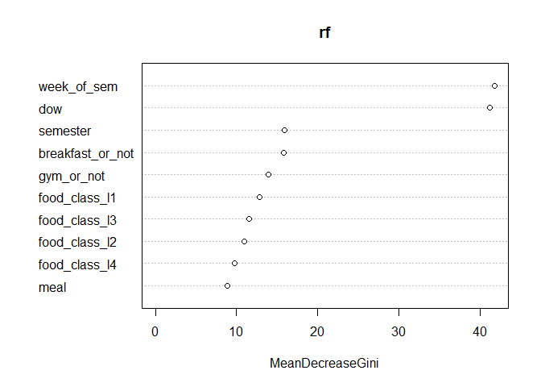

# Estimate and Predict my Food Pattern in Austin Using Data Wrangling and Machine Learning

## Abstract

## Introduction

I started to record my everyday meals in July 2022 by a very incidental
chance. Since then, I spent most of my time in Hong Kong until I moved
to Austin in July 2023. From my experience in Hong Kong, I was wondering
whether people tend to eat better (to relax or to compensate) or simpler
(to save time) when they are busy. However, my life and food patterns in
Hong Kong were too complicated and unpredictable to verify this
hypothesis. Considering the feasibility, I decide to estimate and
predict my life and food patterns in Austin.

When recording meals, there are potential discrepancies and biases due
to my discretion. For example, if I have a brunch (at 10:00) and an
afternoon tea (at 16:00), sometimes I may record them as breakfast and
lunch, but I may also record them as lunch and dinner. Another
discrepancy is the vague distinction between snacks and meals. If I
consider 10 g popcorn as a snack, should I consider 11 g as a meal? If
so, then what about 10.1 g, 10.11 g, or 10 g rice, etc.?

Beyond the discrepancies, I am not very confident in the predictive
accuracy for two additional reasons. First, the data set is small.
Second, although my life in Austin is simple due to some constraints,
the data is from a real human with certain flexibility and
unpredictability. However, it is still fun to know the driving factors
of my life and food patterns.

## Methods

### Data wrangling

I keep `date` when I am in Austin: after Jul 4, 2023 (inclusive),
exclude the Thanksgiving holiday (from Nov 20 to Nov 26, both inclusive)
and winter vacation (from Dec 12, 2023 to Jan 11, 2024, both inclusive).
The initial data looks like this:

<table>
<thead>
<tr class="header">
<th style="text-align: left;">date</th>
<th style="text-align: left;">dow</th>
<th style="text-align: left;">breakfast</th>
<th style="text-align: left;">lunch</th>
<th style="text-align: left;">dinner</th>
</tr>
</thead>
<tbody>
<tr class="odd">
<td style="text-align: left;">7/4/2023</td>
<td style="text-align: left;">Tue</td>
<td style="text-align: left;">NA</td>
<td style="text-align: left;">SouthCloud Ramen</td>
<td style="text-align: left;">NA</td>
</tr>
<tr class="even">
<td style="text-align: left;">7/5/2023</td>
<td style="text-align: left;">Wed</td>
<td style="text-align: left;">MA Econ orientation</td>
<td style="text-align: left;">MA Econ orientation</td>
<td style="text-align: left;">NA</td>
</tr>
<tr class="odd">
<td style="text-align: left;">7/6/2023</td>
<td style="text-align: left;">Thu</td>
<td style="text-align: left;">Home</td>
<td style="text-align: left;">Wendy’s</td>
<td style="text-align: left;">NA</td>
</tr>
<tr class="even">
<td style="text-align: left;">7/7/2023</td>
<td style="text-align: left;">Fri</td>
<td style="text-align: left;">NA</td>
<td style="text-align: left;">Home</td>
<td style="text-align: left;">China Family</td>
</tr>
<tr class="odd">
<td style="text-align: left;">7/8/2023</td>
<td style="text-align: left;">Sat</td>
<td style="text-align: left;">NA</td>
<td style="text-align: left;">Home</td>
<td style="text-align: left;">Home</td>
</tr>
<tr class="even">
<td style="text-align: left;">7/9/2023</td>
<td style="text-align: left;">Sun</td>
<td style="text-align: left;">Home</td>
<td style="text-align: left;">Home</td>
<td style="text-align: left;">NA</td>
</tr>
</tbody>
</table>

During this time, I am studying at The University of Texas at Austin, so
my life pattern heavily depends on the school calendar. Thus, I create a
categotical variable `semester`: it is *summer* when `date` is before
Aug 14 (inclusive), *fall* when `date` is after Aug 15 and before Dec 11
(both inclusive), and *spring* otherwise.

For the same reason, I create a categorical variable `week_of_sem`,
where the first week of a semester is 1, the second is 2, etc. Every
week starts on Monday or the first day of a semester if that day is not
a Monday. I set non-school days as 0, including spring break and days
before or after each semester.

The variation in `breakfast` is close to zero as I eat at home most of
the time. To extract useful information, I convert `breakfast` to a
binary variable `breakfast_or_not`, because having breakfast may
indicate going out, and its food pattern may be different from staying
at home.

Visiting sports facilities may signal certain life patterns, though
patterns may differ between on-campus gyms and off-campus fields. I
obtain my visiting records of sports facilities from [UT Recreational
Sports](https://secure.rs.utexas.edu/store/index.php). I create a binary
variable `gym_or_not`, measuring whether I visit sports facilities on a
day.

I convert the data frame from wide format to long format.

I am interested in estimating and predicting my food pattern. For ease
of implementation, I create a categorical variable `food_class`
representing three `food` categories: *home*, *canteen* (including *J2
Dining*, *Jester City Limits*, and *Kins Dining*), and *other*.

Previous meals have impacts on the choice of the next meal. On one hand,
I may get bored with previous meals (diminishing marginal return). On
the other hand, I may be reluctant or constrained to change life and
food patterns. Therefore, I create four lagging variables of
`food_class`. I drop the first four observations and the first four
observations after winter break.

Here is the data after all processing:

<table style="width:100%;">
<colgroup>
<col style="width: 8%" />
<col style="width: 11%" />
<col style="width: 11%" />
<col style="width: 11%" />
<col style="width: 11%" />
<col style="width: 5%" />
<col style="width: 7%" />
<col style="width: 9%" />
<col style="width: 3%" />
<col style="width: 13%" />
<col style="width: 8%" />
</colgroup>
<thead>
<tr class="header">
<th style="text-align: left;">food_class</th>
<th style="text-align: left;">food_class_l1</th>
<th style="text-align: left;">food_class_l2</th>
<th style="text-align: left;">food_class_l3</th>
<th style="text-align: left;">food_class_l4</th>
<th style="text-align: left;">meal</th>
<th style="text-align: left;">semester</th>
<th style="text-align: left;">week_of_sem</th>
<th style="text-align: left;">dow</th>
<th style="text-align: left;">breakfast_or_not</th>
<th style="text-align: left;">gym_or_not</th>
</tr>
</thead>
<tbody>
<tr class="odd">
<td style="text-align: left;">other</td>
<td style="text-align: left;">home</td>
<td style="text-align: left;">other</td>
<td style="text-align: left;">other</td>
<td style="text-align: left;">other</td>
<td style="text-align: left;">dinner</td>
<td style="text-align: left;">summer</td>
<td style="text-align: left;">0</td>
<td style="text-align: left;">Fri</td>
<td style="text-align: left;">0</td>
<td style="text-align: left;">0</td>
</tr>
<tr class="even">
<td style="text-align: left;">home</td>
<td style="text-align: left;">other</td>
<td style="text-align: left;">home</td>
<td style="text-align: left;">other</td>
<td style="text-align: left;">other</td>
<td style="text-align: left;">lunch</td>
<td style="text-align: left;">summer</td>
<td style="text-align: left;">0</td>
<td style="text-align: left;">Sat</td>
<td style="text-align: left;">0</td>
<td style="text-align: left;">0</td>
</tr>
<tr class="odd">
<td style="text-align: left;">home</td>
<td style="text-align: left;">home</td>
<td style="text-align: left;">other</td>
<td style="text-align: left;">home</td>
<td style="text-align: left;">other</td>
<td style="text-align: left;">dinner</td>
<td style="text-align: left;">summer</td>
<td style="text-align: left;">0</td>
<td style="text-align: left;">Sat</td>
<td style="text-align: left;">0</td>
<td style="text-align: left;">0</td>
</tr>
<tr class="even">
<td style="text-align: left;">home</td>
<td style="text-align: left;">home</td>
<td style="text-align: left;">home</td>
<td style="text-align: left;">other</td>
<td style="text-align: left;">home</td>
<td style="text-align: left;">lunch</td>
<td style="text-align: left;">summer</td>
<td style="text-align: left;">0</td>
<td style="text-align: left;">Sun</td>
<td style="text-align: left;">1</td>
<td style="text-align: left;">0</td>
</tr>
<tr class="odd">
<td style="text-align: left;">other</td>
<td style="text-align: left;">home</td>
<td style="text-align: left;">home</td>
<td style="text-align: left;">home</td>
<td style="text-align: left;">other</td>
<td style="text-align: left;">lunch</td>
<td style="text-align: left;">summer</td>
<td style="text-align: left;">1</td>
<td style="text-align: left;">Mon</td>
<td style="text-align: left;">1</td>
<td style="text-align: left;">0</td>
</tr>
<tr class="even">
<td style="text-align: left;">other</td>
<td style="text-align: left;">other</td>
<td style="text-align: left;">home</td>
<td style="text-align: left;">home</td>
<td style="text-align: left;">home</td>
<td style="text-align: left;">lunch</td>
<td style="text-align: left;">summer</td>
<td style="text-align: left;">1</td>
<td style="text-align: left;">Tue</td>
<td style="text-align: left;">1</td>
<td style="text-align: left;">0</td>
</tr>
</tbody>
</table>

### Predict my food pattern using classification models

The outcome variable (y variable) `food_class` is categorical. Before
any analysis, here is the number of observations in each category:

<table>
<thead>
<tr class="header">
<th style="text-align: left;">food_class</th>
<th style="text-align: right;">count</th>
</tr>
</thead>
<tbody>
<tr class="odd">
<td style="text-align: left;">canteen</td>
<td style="text-align: right;">101</td>
</tr>
<tr class="even">
<td style="text-align: left;">home</td>
<td style="text-align: right;">227</td>
</tr>
<tr class="odd">
<td style="text-align: left;">other</td>
<td style="text-align: right;">68</td>
</tr>
</tbody>
</table>

I do not scale or normalize the data, as all features (x variables) are
categorical.

I set 80% of the observations as training data, and 20% as test data. I
fit classification models with training data, predict outcomes on test
data, and compare the predicted outcomes to the actual outcomes.

#### Logistic regression

I include all features and most of their interactions in logistic
regression. The reason for including interactions is, for example, a
lunch on Monday may differ from one on Saturday, depending on my class
schedule. For easy computation, I omit four interactions:
`food_class_l4 * week_of_sem`, `semester * dow`, `week_of_sem * dow`,
and `semester * week_of_sem`. I use softmax function to handle three
classes in the outcome variable.

#### Lasso regularization

Logistic regression with too many features may result in overfitting.
Thus, I use lasso to regularize the above model. I use 10-fold cross
validation in the training data to find the optimal regularization
parameter *λ*.

#### Naive Bayes

Naive Bayes assumes every feature is independent of all other features,
conditional on the class labels of the outcome variable. This assumption
contradicts the assumption of interactions in the logistic regression
section above. However, it is still worth a try to fit a Naive Bayes
model with all features.

#### KNN

KNN measures “distances” between features, which is not strictly
appropriate for this data set with categorical features since the
distances between categories are not clear. However, it is still worth a
try to fit a KNN model with all features. I use 10-fold cross validation
in the training data to find the optimal number of neighbors *k*.

#### Random forest

I include all features in random forest.

#### CatBoost

CatBoost is a gradient boosting model for handling categorical features.
I include all features in CatBoost.

### Driving factors of my food pattern

Find dominant features among all features and their interactions.

### Comments on unsupervised learning

## Results

### Overall accuracies of classification models

<table>
<thead>
<tr class="header">
<th style="text-align: left;">model</th>
<th style="text-align: right;">overall_accuracy</th>
</tr>
</thead>
<tbody>
<tr class="odd">
<td style="text-align: left;">Logistic regression</td>
<td style="text-align: right;">0.7564</td>
</tr>
<tr class="even">
<td style="text-align: left;">Lasso regularization</td>
<td style="text-align: right;">0.7179</td>
</tr>
<tr class="odd">
<td style="text-align: left;">Naive Bayes</td>
<td style="text-align: right;">0.7821</td>
</tr>
<tr class="even">
<td style="text-align: left;">KNN</td>
<td style="text-align: right;">0.8077</td>
</tr>
<tr class="odd">
<td style="text-align: left;">Random forest</td>
<td style="text-align: right;">0.7821</td>
</tr>
<tr class="even">
<td style="text-align: left;">CatBoost</td>
<td style="text-align: right;">0.8077</td>
</tr>
</tbody>
</table>

Overall accuracy measures the fraction of accurate predictions among
outcomes in test data.

CatBoost

## Conclusion

## Appendix

Below are confusion matrices of predictive models. In a confusion
matrix, each column is an original class, each row is a predicted class.

Logistic regression:

<table>
<thead>
<tr class="header">
<th style="text-align: left;"></th>
<th style="text-align: right;">canteen</th>
<th style="text-align: right;">home</th>
<th style="text-align: right;">other</th>
</tr>
</thead>
<tbody>
<tr class="odd">
<td style="text-align: left;">canteen</td>
<td style="text-align: right;">13</td>
<td style="text-align: right;">5</td>
<td style="text-align: right;">1</td>
</tr>
<tr class="even">
<td style="text-align: left;">home</td>
<td style="text-align: right;">6</td>
<td style="text-align: right;">34</td>
<td style="text-align: right;">0</td>
</tr>
<tr class="odd">
<td style="text-align: left;">other</td>
<td style="text-align: right;">1</td>
<td style="text-align: right;">6</td>
<td style="text-align: right;">12</td>
</tr>
</tbody>
</table>

Lasso regularization:

<table>
<thead>
<tr class="header">
<th style="text-align: left;"></th>
<th style="text-align: right;">canteen</th>
<th style="text-align: right;">home</th>
<th style="text-align: right;">other</th>
</tr>
</thead>
<tbody>
<tr class="odd">
<td style="text-align: left;">canteen</td>
<td style="text-align: right;">12</td>
<td style="text-align: right;">6</td>
<td style="text-align: right;">1</td>
</tr>
<tr class="even">
<td style="text-align: left;">home</td>
<td style="text-align: right;">7</td>
<td style="text-align: right;">33</td>
<td style="text-align: right;">1</td>
</tr>
<tr class="odd">
<td style="text-align: left;">other</td>
<td style="text-align: right;">1</td>
<td style="text-align: right;">6</td>
<td style="text-align: right;">11</td>
</tr>
</tbody>
</table>

Naive Bayes:

<table>
<thead>
<tr class="header">
<th style="text-align: left;"></th>
<th style="text-align: right;">canteen</th>
<th style="text-align: right;">home</th>
<th style="text-align: right;">other</th>
</tr>
</thead>
<tbody>
<tr class="odd">
<td style="text-align: left;">canteen</td>
<td style="text-align: right;">16</td>
<td style="text-align: right;">7</td>
<td style="text-align: right;">2</td>
</tr>
<tr class="even">
<td style="text-align: left;">home</td>
<td style="text-align: right;">3</td>
<td style="text-align: right;">37</td>
<td style="text-align: right;">3</td>
</tr>
<tr class="odd">
<td style="text-align: left;">other</td>
<td style="text-align: right;">1</td>
<td style="text-align: right;">1</td>
<td style="text-align: right;">8</td>
</tr>
</tbody>
</table>

KNN:

<table>
<thead>
<tr class="header">
<th style="text-align: left;"></th>
<th style="text-align: right;">canteen</th>
<th style="text-align: right;">home</th>
<th style="text-align: right;">other</th>
</tr>
</thead>
<tbody>
<tr class="odd">
<td style="text-align: left;">canteen</td>
<td style="text-align: right;">14</td>
<td style="text-align: right;">3</td>
<td style="text-align: right;">2</td>
</tr>
<tr class="even">
<td style="text-align: left;">home</td>
<td style="text-align: right;">6</td>
<td style="text-align: right;">42</td>
<td style="text-align: right;">4</td>
</tr>
<tr class="odd">
<td style="text-align: left;">other</td>
<td style="text-align: right;">0</td>
<td style="text-align: right;">0</td>
<td style="text-align: right;">7</td>
</tr>
</tbody>
</table>

Random forest:

<table>
<thead>
<tr class="header">
<th style="text-align: left;"></th>
<th style="text-align: right;">canteen</th>
<th style="text-align: right;">home</th>
<th style="text-align: right;">other</th>
</tr>
</thead>
<tbody>
<tr class="odd">
<td style="text-align: left;">canteen</td>
<td style="text-align: right;">14</td>
<td style="text-align: right;">6</td>
<td style="text-align: right;">2</td>
</tr>
<tr class="even">
<td style="text-align: left;">home</td>
<td style="text-align: right;">5</td>
<td style="text-align: right;">39</td>
<td style="text-align: right;">3</td>
</tr>
<tr class="odd">
<td style="text-align: left;">other</td>
<td style="text-align: right;">1</td>
<td style="text-align: right;">0</td>
<td style="text-align: right;">8</td>
</tr>
</tbody>
</table>

CatBoost:

<table>
<tbody>
<tr class="odd">
<td style="text-align: left;"></td>
<td style="text-align: left;">canteen</td>
<td style="text-align: left;">home</td>
<td style="text-align: left;">other</td>
</tr>
<tr class="even">
<td style="text-align: left;">canteen</td>
<td style="text-align: left;">0</td>
<td style="text-align: left;">0</td>
<td style="text-align: left;">0</td>
</tr>
<tr class="odd">
<td style="text-align: left;">home</td>
<td style="text-align: left;">0</td>
<td style="text-align: left;">0</td>
<td style="text-align: left;">0</td>
</tr>
<tr class="even">
<td style="text-align: left;">other</td>
<td style="text-align: left;">0</td>
<td style="text-align: left;">0</td>
<td style="text-align: left;">0</td>
</tr>
</tbody>
</table>
